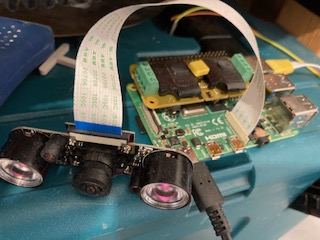
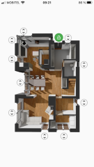
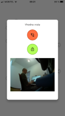
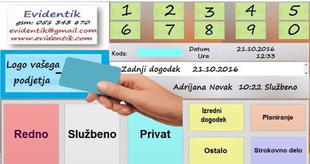
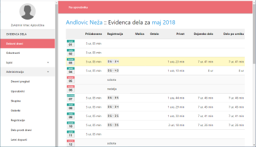
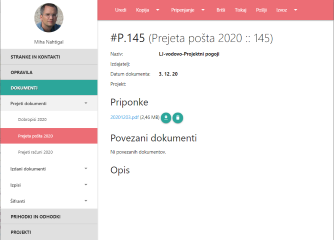
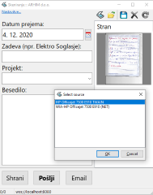
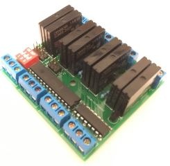
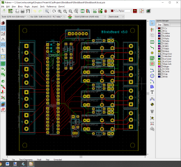

# CV #

V dokumentu navajam IT projekte, ki sem jih v glavnem sproduciral sam. Pri nekaterih je šlo za sodelovanje z drugim podjetjem, tam je to izrecno navedeno.
Projekti so navedeni v približnem vrstnem redu, od najbolj svežega do najstarejšega.
  
  
  
## PAMETNI DOMOFON ##
    

Projekt je nastal zaradi potrebe po domačem domofonu. Trg ponuja sorazmerno slabo izbiro, kar pa približno ustreza zahtevam pa ima sorazmerno visoko ceno (npr. Doorbird ca 700€). Zaradi tega je nastal kompleten produkt, ki zelo dobro opravlja svojo funkcijo. 
Osnovni HW je na bazi RPI in UV4L video in audio streaminga ter motion-a za prepoznavo gibanja. Client side je za pametne telefone napisan v Flutter-ju.
 
  

## REGISTRACIJA DELOVNEGA ČASA EVIDENTIK ##
  

Projekt je izveden po naročilu stranke. Gre za celotno okolje za beleženje delovnega časa.  
Registratorji so fizične konzole na osnovi RaspberryPi, ki pošiljajo podatke na strežnik, kjer PHP aplikacija upravlja z izračuni, prikazi, izpisi, obračuni za plače.  
Aplikacija na RPI je bila narejena v Lazarusu oz. FreePascalu, z možnost cross-platform compiliranja tudi na Windows, Android,...  

 
  
  
  
## ARHINT INTRANET SISTEM ##
   

Intranet sistem za CRM, izdane račune, potne naloge, opravila, dokumentni sistem in finančno poslovanje podjetja.  
Portal vključuje MS Exchange server sinhronizacijo na osnovi projekta Sinchroton, ki skrbi za sinhronizacijo kontaktov in opravil s pametnimi telefoni.  
Z vidika finančnega poslovanja vključuje PHP davčno potrjevanje, ESLOG elektronsko podpisovanje, izvoz ESLOG 1.6 in 2.0 in izvoz SEPA XML.  
Posebnost poslovanja z računi je, da je vključeno podpisovanje računov s client certifikatom v brskalniku s komponento idTokenSigning.  
Dokumentno poslovanje vključuje skeniranje prejete pošte neposredno iz spletne strani preko Websocketov in lokalne aplikacije za skeniranje (websocket server) napisane v Lazarus.  

 
  
  
  
## PAMETNE ŽALUZIJE BLINDSBOARDv3 ##
  

Sistem za upravljanje domačih žaluzij je narejen na osnovi Arduino kontrolerja in lastne PCB plošče ter pameti za upravljanje.   
Arduino preko serijskega vmesnika komunicira z RPI, kjer je postavljen Homebridge, ki služi za posrednika med Apple Homekit tehnologijo in HW.  
S tem lahko uporabnik upravlja želuzje preko aplikacije "Home" v Apple okolju

 
  
  
  
## HOBY :: HOTELSKI SISTEM eHotelDesk ##

Kopletni sistem za rezervacije gostov. Opensource na naslovu https://github.com/malamalca/ehoteldesk

  
  
  
## HOBY :: DRUŽINSKO DREVO FAMIREE ##

Projekt je nastal z željo, da se podatki iz družinskega drevesa prenesejo iz oblaka (Geni) v lokalno aplikacijo. Projekt je Opensource dosegljiv na https://github.com/malamalca/famiree

